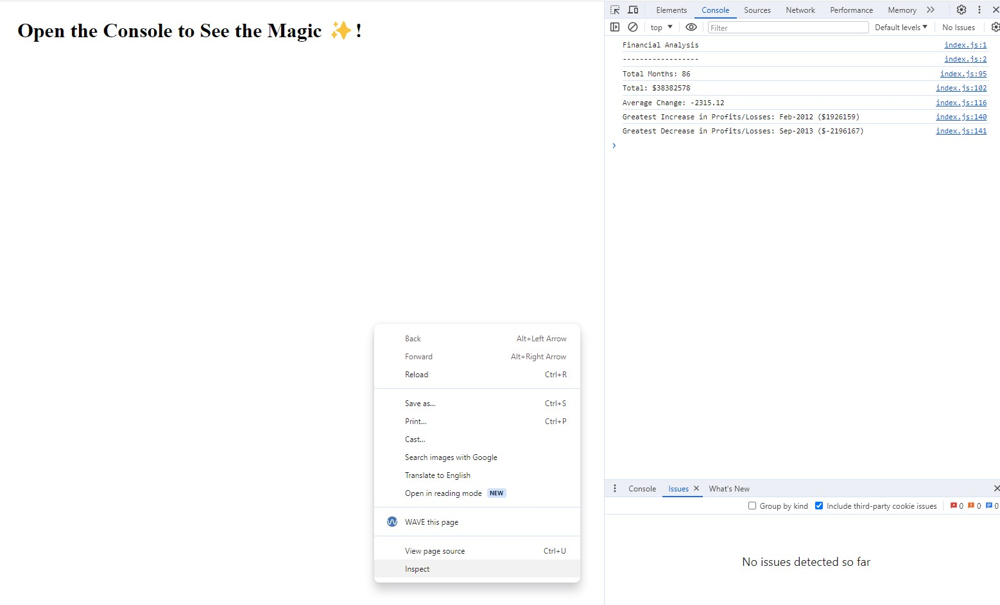

# Console-Finances

## Description

The aim of this project is calculate the total number of months and average profit/loss from the date provided. It also calculates which month had the largest increase in profit/loss and which date had the largest decrease in proft/loss.

The information is then displayed in the console.

The website can be viewed [here](https://duouk2000.github.io/Console-Finances)

## Installation

NA

## Usage

The results can be accesed by accessing the devloper console, either by pressing the F12 key on your keyboard, or by right clicking your mouse and left cliking 'inspect'

## Screenshot

    
## Credits

- Websites used to review and test javascript commands & tutorials - [w3schools](https://www.w3schools.com/html/default.asp) /
[MDN Web Docs](https://developer.mozilla.org/en-US/docs/Learn/HTML)

- Websites reviewed to help generate a badge - [Shields.io](https://shields.io/badges) & [lukas-h github](https://gist.github.com/lukas-h/2a5d00690736b4c3a7ba)

## License

MIT License

Copyright (c) 2024 Andrew Sinkinson

Permission is hereby granted, free of charge, to any person obtaining a copy of this software and associated documentation files (the “Software”), to deal in the Software without restriction, including without limitation the rights to use, copy, modify, merge, publish, distribute, sublicense, and/or sell copies of the Software, and to permit persons to whom the Software is furnished to do so, subject to the following conditions:

The above copyright notice and this permission notice shall be included in all copies or substantial portions of the Software.

THE SOFTWARE IS PROVIDED “AS IS”, WITHOUT WARRANTY OF ANY KIND, EXPRESS OR IMPLIED, INCLUDING BUT NOT LIMITED TO THE WARRANTIES OF MERCHANTABILITY, FITNESS FOR A PARTICULAR PURPOSE AND NONINFRINGEMENT. IN NO EVENT SHALL THE AUTHORS OR COPYRIGHT HOLDERS BE LIABLE FOR ANY CLAIM, DAMAGES OR OTHER LIABILITY, WHETHER IN AN ACTION OF CONTRACT, TORT OR OTHERWISE, ARISING FROM, OUT OF OR IN CONNECTION WITH THE SOFTWARE OR THE USE OR OTHER DEALINGS IN THE SOFTWARE.

## Badges

